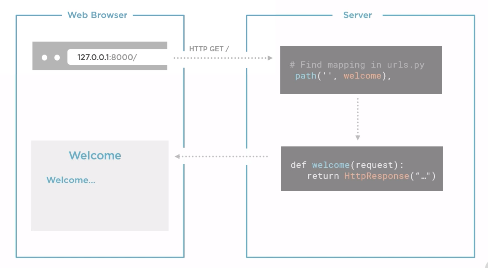
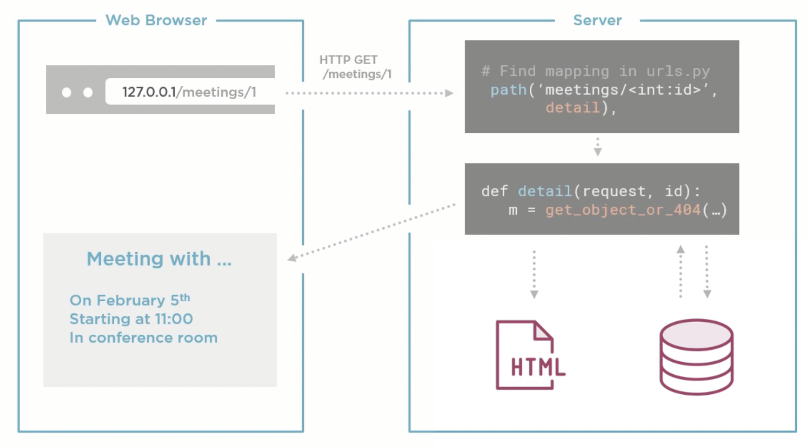

# README

Contents

- [How to create a Django project](#how-to-create-a-django-project)
- [How to run a Django project](#how-to-run-a-django-project)
- [Create a simple web page](#create-a-simple-web-page)
  - [Create a Django app](#create-a-django-app)
  - [Add a view function](#add-a-view-function)
  - [Assign a URL](#assign-a-url)
  - [Run and view the page](#run-and-view-the-page)
  - [Control Flow](#control-flow)
- [Setting up a Data Model](#setting-up-a-data-model)
- [Django Model class](#django-model-class)
  - [Create and run migrations](#create-and-run-migrations)
- [The Model-Template-View pattern (MTV)](#the-model-template-viewppattern-mtv)

# How to create a Django project

Within the main folder:

- Create a virtual env - `python3 -m venv .venv`
- Activate the virtual env - `source .venv/bin/activate`
- Install django - `pip install django`
- Create the django project - `django-admin startproject meeting_planner`

The last command will create the following folder structure

```bash
.
├── README.md
└── meeting_planner
    ├── manage.py
    └── meeting_planner
        ├── __init__.py
        ├── asgi.py
        ├── settings.py
        ├── urls.py
        └── wsgi.py

3 directories, 7 files
```

# How to run a Django project

Go to the project folder and run `python manage.py runserver`.

The server will run on http://127.0.0.1:8000/.

By running runserver, a `db.sqlite3` files is created and added to the project folder.

# Create a simple web page

## Create a Django app

For app is intended a folder that contains python files.
The following command will need to be run in the folder that contains the _manage.py_ file

`python manage.py startapp <app name>`

Main folder structure after the command.

```bash
.
├── README.md
└── meeting_planner
    ├── db.sqlite3
    ├── manage.py
    ├── meeting_planner
    │   ├── __init__.py
    │   ├── asgi.py
    │   ├── settings.py
    │   ├── urls.py
    │   └── wsgi.py
    └── website
        ├── __init__.py
        ├── admin.py
        ├── apps.py
        ├── migrations
        │   └── __init__.py
        ├── models.py
        ├── tests.py
        └── views.py

```

The `__init__.py` indicates that the folder is a python package.

To be able to make sure that Django picks up the new app, go to _settings.py_ in the meeting planner and add to the **INSTALLED_APP** the name of the new app.

```python
INSTALLED_APPS = [
    'django.contrib.admin',
    'django.contrib.auth',
    'django.contrib.contenttypes',
    'django.contrib.sessions',
    'django.contrib.messages',
    'django.contrib.staticfiles',
    # Internal APP
    'website',
]
```

## Add a view function

In the **views.py** file add a view function, that will handle an http request for the welcome page of the website. When a user reaches the welcome page, the function will be called, and a string will be returned so that can be shown in the browser.

## Assign a URL

Open the **urls.py**, import the new view, and then add the path with 2 arguments. The first argument is the url, the second argument is the view function.

## Run and view the page

Run the server with `python manage.py runserver`, then go to http://127.0.0.1:8000/welcome.html and verify that the message is the same as the one set in the views.py

## Control Flow

The web server will only run when a request is made. When a page is visited it will send an HTTP get request to the server. The log will show `"GET /welcome.html HTTP/1.1" 200 30`



# Setting up a Data Model

## Django Model class

Models are:

- python classes, used to store data so that if the server stops the data is not lost.
- mapped to database tables
- each object is a row in the table

## Create and run migrations

Migrations are:

- python scripts that will generate the tables
- used to keep db structure in sync with code
- auto-generated scripts (not if the migrations are too complicated)

## Best practice

Create a new app that will be the one dealing with the meeting data
`python manage.py startapp meetings`

# The Model-Template-View pattern (MTV)

## Model

Rappresents the data that lives in our application. In django we write model classes that map to DB tables

## Template

Responsability to create a user friendly presentation, and it does so by generating an HTML page that will be shown in the browser

## View

Defines the behavior of a page, determines what is the appropriate content to send to the client. Contains python function and it's mapped to a URL

## MTV flow


